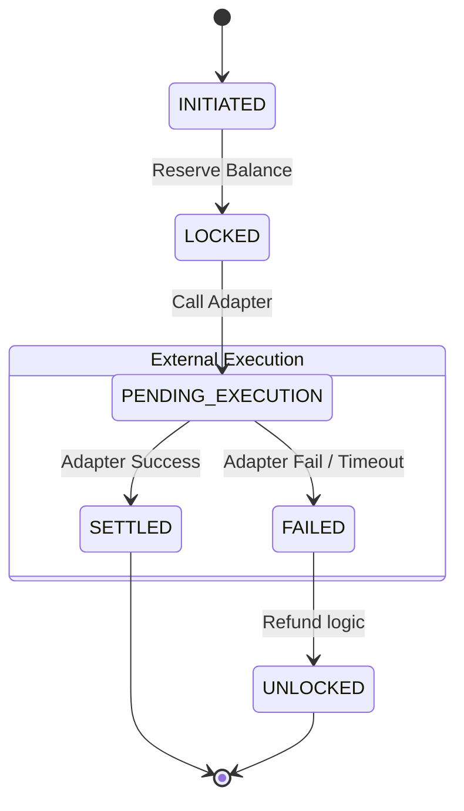

# 🏗️ System Architecture

Project Fusion is designed as a **Universal Payment Orchestrator**. It abstracts valid financial rails (Banks, Crypto, Fintechs) into a unified state machine, ensuring consistency even when underlying networks fail.

---

## 🧩 High-Level Design

The system is composed of three primary layers:
1.  **Control Plane (Node.js)**: The brain. Handles API requests, policy checks, and the shadow ledger.
2.  **Data Plane (PostgreSQL)**: The memory. Stores the atomic state of every transaction.
3.  **Adapter Plane**: The limbs. Connects to external worlds (Stripe, Stellar, etc.).

```mermaid
graph TD
    classDef secure fill:#f9f,stroke:#333,stroke-width:2px;
    classDef core fill:#bbf,stroke:#333,stroke-width:2px;
    classDef ext fill:#ddd,stroke:#333,stroke-width:2px;

    Client[Your App / Postman] -->|mTLS + API Key| L7[Load Balancer / Ingress]
    L7 --> API[API Gateway]:::core

    subgraph "Project Fusion Core (Trusted Zone)"
        API --> Policy[Policy Engine (KYC/AML)]:::secure
        Policy --> DB[(Shadow Ledger)]:::secure
        DB --> Saga[Saga Manager]:::core
    end

    subgraph "Reconciliation Layer"
        Cron[Cron / Worker] -->|Scan Pending| DB
        Cron -->|Query Status| Adapters
    end

    subgraph "Adapter Layer (Plugins)"
        Saga -->|Route| Adapters[Adapter Hub]
        Adapters -->|HTTP| Stripe[Stripe API]:::ext
        Adapters -->|RPC| Stellar[Stellar Network]:::ext
        Adapters -->|ISO20022| Bank[Swift/Sepa]:::ext
    end
```

---

## 🔄 The Saga Pattern (Reliability)

Traditional systems use "ACID" transactions. Distributed systems (like payments) cannot use ACID across boundaries (you can't "rollback" a Stripe charge if your DB fails).
Instead, we use **Sagas**: a sequence of local transactions.

### State Machine Lifecycle
Every instruction travels through this strictly enforced path:

1.  **`INITIATED`**: Request received, basic validation passed.
2.  **`LOCKED`**: Internal ledger balance reserved (Double-Entry hold).
    *   *Invariant*: User cannot double-spend these funds.
3.  **`PENDING_EXECUTION`**: Adapter has been called.
    *   *Danger Zone*: If the server crashes here, we have "Ghost Money".
4.  **`SETTLED`** (Success) OR **`FAILED`** (Compensation).
    *   *Compensation*: If FAILED, the `LOCKED` funds are released back to the user.



### 👻 Ghost Money Reconciliation
If a transaction stays in `PENDING_EXECUTION` for > 60 seconds (due to crash or timeout), the **Reconciliation Worker**:
1.  Wakes up.
2.  Calls the Adapter's `checkStatus(id)` function.
3.  **Repair**:
    *   If Provider says "Success" -> Update DB to `SETTLED`.
    *   If Provider says "Failed" -> Update DB to `FAILED` and Refund.
    *   If Provider says "Unknown" -> Move to `MANUAL_CHECK`.

---

## 🔐 Security Architecture

### 1. Zero Trust Network (mTLS)
We assume the internal network is hostile.
*   **Authentication**: Mutual TLS. The Client must present a valid certificate signed by our CA.
*   **Authorization**: API Keys scoped to specific roles.

### 2. Vault Simulation (HSM)
Private keys (for signing Crypto transactions or Bank instructions) are **never** exposed to the application code.
*   **vaultProvider.js** acts as a simulated Hardware Security Module (HSM).
*   App requests: "Please sign this payload."
*   Vault responds: "Here is the signature."

---

## 📂 Directory Structure

```bash
├── adapters/           # The plugins for external rails (Stripe, Stellar)
├── certs/              # mTLS certificates (Generated by setup.js)
├── client/             # Next.js Dashboard (The "Control Tower")
├── db/                 # SQL Schemas and migrations
├── docs/               # You are here
├── tests/              # Jest test suites
│   ├── unit/           # Logic tests
│   ├── integration/    # API tests
│   └── load/           # Artillery scripts
├── server.js           # Entry point
└── policyEngine.js     # Compliance logic
```
