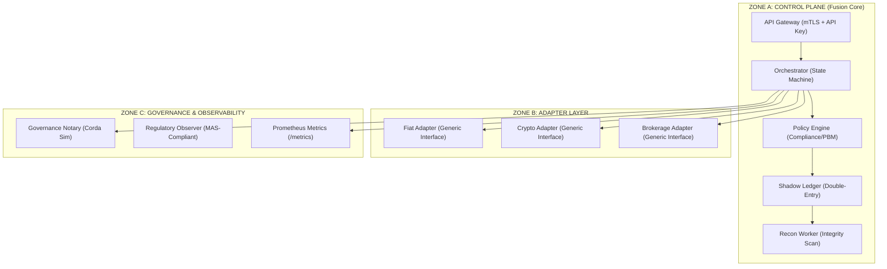

# Project Fusion

**Orchestration Architecture for Multi-Rail Financial Settlement**

**Status:** **Institutional Prototype** | **Hardened Testnet Stage** | **Internal Testing Ready**

---

## 🚀 Institutional Summary

Project Fusion is a **universal orchestration control-plane** designed to unify settlement across any financial rail: Fiat (SWIFT/ACH/RTP), Digital Assets (Blockchains/CBDCs), and Brokerage (Equities/Bonds).

It acts as the **single source of truth** and atomic coordinator, abstracting the complexity of underlying providers. Stripe and Stellar are currently implemented only as **Reference Adapters** to demonstrate the system's multi-rail capabilities.

### **Core Capabilities**
- **Unified Policy Enforcement**: Centralized AMC/KYC/PBM logic across all asset rails.
- **Atomic Double-Entry Ledger**: Every instruction generates immutable balance-locked journal entries.
- **Saga-Based Reliability**: Integrated compensation logic and background reconciliation ("Ghost Money" prevention).
- **Hardened Security**: Mutual TLS (mTLS), Vault-resident key management, and HMAC-SHA256 derivation.

---

## 🏛️ System Architecture

Fusion operates as a decoupled coordination layer separated into three structural zones.

### **High-Level Design**



---

## 🛡️ Security Implementation

Project Fusion employs a "Defense in Depth" strategy to protect sensitive financial operations.

### **1. Mutual TLS (mTLS)**
All communication is protected by X.509 certificate validation. Both the client and server must present trust-anchored certificates, ensuring mutual identity verification before any routing logic executes.

### **2. Vault-Resident Key Signing (HSM Simulation)**
Private keys never leave the secure boundary of `vaultProvider.js`. 
- **Derivation**: Uses HMAC-SHA256 with a master secret to derive 32-byte seeds (full 256-bit entropy).
- **Isolation**: Adapters request signatures via the Vault API; they never handle raw private keys or seeds.

### **3. Deterministic Lifecycle**
Instructions follow an immutable state machine, preventing "double-spend" or race conditions:
`INITIATED` ➔ `LOCKED` (Balance Reserved) ➔ `PENDING_EXECUTION` ➔ `SETTLED` / `FAILED` / `MANUAL_CHECK`.

### **4. Strict Idempotency**
The server enforces **exactly-once processing** by requiring a unique `x-idempotency-key` header for every state-changing request. Replays are detected and rejected to prevent double-spending.

---

## 📏 API Standards (Institutional)

All API calls must adhere to strict institutional headers to ensure security and reliability.

| Header | Required | Purpose |
| :--- | :--- | :--- |
| `x-api-key` | YES | Authentication (matches environment secret) |
| `x-idempotency-key` | YES | **Critical**: Unique key (UUID) to prevent double-spending on retries. |

**Note:** Requests missing `x-idempotency-key` will be rejected with `400 Bad Request`.

---

## 📈 Institutional Observability

Fusion exposes industry-standard monitoring endpoints for orchestration health and performance.

### **Monitoring Endpoints**
| Endpoint | Purpose | target |
| :--- | :--- | :--- |
| `/health` | Liveness Probe | Kubernetes / LB |
| `/health/detailed` | Dependency Health | DB, Vault, External Rails |
| `/metrics` | Performance Data | Prometheus / Grafana |

### **Prometheus Metrics Schema**
- `fusion_requests_total`: Cumulative API request counter.
- `fusion_transactions_success_total`: Settled transaction count.
- `fusion_transactions_failed_total`: Failed execution tracking.
- `fusion_last_request_timestamp`: Timestamp gauge for liveness monitoring.

---

## 🔄 Ghost Money Prevention (Reconciliation)

A background worker runs every 60 seconds to scan for transactions stuck in `PENDING_EXECUTION`.
1. **Query Adapter Status**: The worker queries the underlying rail (e.g., Stripe API) using the saved `external_intent_id`.
2. **State Recovery**: If the external rail reports success but the server crashed before writing the ledger, the worker recovers the state to `SETTLED`.
3. **Manual Check Handover**: If status is ambiguous, the transaction is moved to `MANUAL_CHECK` for human audit, preventing asset leakage.

---

## 🛠️ Technology Stack

- **Backend**: Node.js (Hardened with `express-rate-limit`, `helmet`, and `joi`)
- **Database**: PostgreSQL (Serialized transactions for ledger integrity)
- **Modules**: Pluggable Adapter Architecture (Current Refs: Stripe-Mock, Stellar-Testnet)
- **Logging**: Pino (Structured JSON logging for ELK/Datadog - **Active**)
- **Testing**: Jest (70% coverage requirement)

---

## 🚦 Getting Started

### **1. Environment Setup**
```bash
# Install dependencies
npm install

# Initialize Database
psql -d fusion_db -f db/schema.sql
```

### **2. Secure Server Startup**
```bash
# Requires certs/ directory to be populated
node server.js
```

### **3. Institutional Verification**
Execute the comprehensive verification suite to validate mTLS, Metrics, Health, and Secure Crypto flows:
```bash
node verify_institutional.js
```

### **4. Institutional Scale Test (600+ TPS)**
Verify the system's high-throughput capability (Configured for 40,000 req/min):
```bash
node load_test_scale.js
# Expected Result: ~660 TPS (5000 requests in <8 seconds)
```

---

## ⚖️ Regulatory Observability (MAS Compliant)

Fusion supports **Read-Only Regulatory Audit** through the `/api/observe` endpoint.
- **PII Protection**: Customer names and account numbers are scrubbed.
- **Decision Traceability**: Regulators can verify that `evaluatePolicy` was executed with a valid cryptographic permit before asset movement occurred.
- **Audit Neutrality**: The system provides evidence without requiring access to the actual settlement pools.

---

## 📅 Roadmap

- **✅ Phase 1 & 2**: Core Orchestration, mTLS, Vault Security, and Reconciler (Completed).
- **✅ Phase 3: Pilot**: Distributed locking, Exponential backoff for adapters, Rate limiting integration.
- **📅 Phase 4: Production**: CloudHSM (PKCS#11), Corda BFT, and Kubernetes multi-AZ.

---

## License
MIT License.

---


