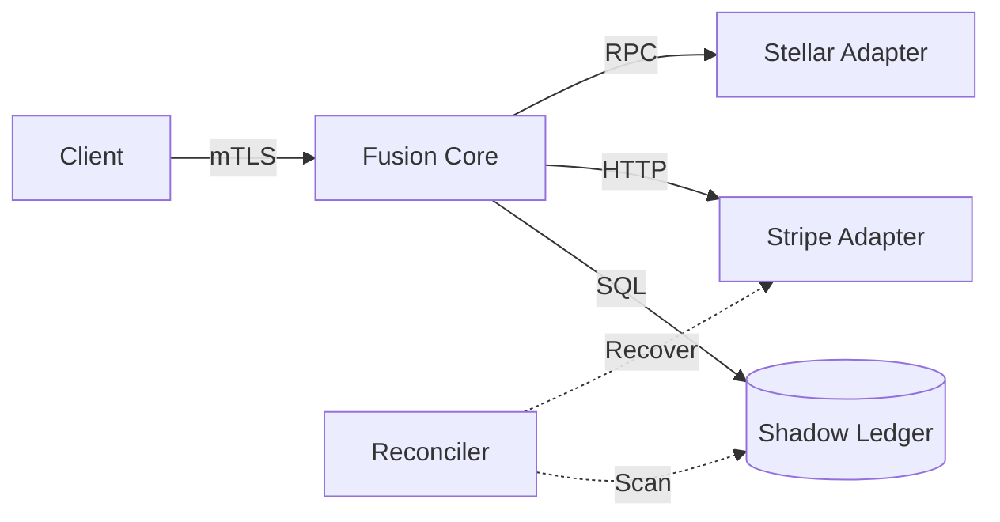

# Project Fusion

[](#)
[](#)
[](#)

> **"Ghost Money Prevention Engine"**
> An institutional-grade Payment Orchestration Platform designed to guarantee financial correctness across fragmented rails (Stripe, Stellar, Banks).

---

## 🚀 The Problem: Ghost Money

In distributed financial systems, API failures are inevitable. A "Ghost Transaction" occurs when money leaves the sender (Stripe Charge: Success) but the database crashes before recording it.
**Result**: The user paid, but the system doesn't know.

**Project Fusion solves this** by implementing a **Saga-based State Machine** with an atomic shadow ledger and automated reconciliation workers that recover lost states.

---

## ⚡ Quick Start (Zero Config)

Run the entire stack (Database, Certs, API, Migrations) with one command:

```bash
# Install dependencies & Auto-Setup
npm install
npm run setup

# Start the Secure Server (mTLS enabled)
npm start
```

_The system will self-heal if the database is missing._

---

## 🏗️ Architecture

See full details in **[docs/ARCHITECTURE.md](docs/ARCHITECTURE.md)** and the **[Technical Manual](docs/TECHNICAL_MANUAL.md)**.

Fusion acts as a **Universal Adapter**. It doesn't care if the money moves via Swift, Blockchain, or Credit Card. It normalizes all rails into a single `Instruction` lifecycle.

### Core Components

1.  **Saga Manager**: Coordinates multi-step transactions (Lock -> Execute -> Settle).
2.  **Shadow Ledger**: Double-entry accounting system that mirrors external reality.
3.  **Vault Simulator**: Isolated module for cryptographic signing (simulates an HSM).
4.  **Reconciler**: Background worker that fixes "stuck" transactions.



---

## 🛡️ Security Features (Institutional Grade)

- **Mutual TLS (mTLS)**: Zero Trust networking. Both client and server verify identity certificates.
- **Idempotency Keys**: `x-idempotency-key` header enforcement prevents double-spending on retries.
- **PII Redaction**: Logs are structured (JSON) but strictly sanitized of user data.
- **Rate Limiting**: Token bucket algorithm prevents DDoS attacks.

---

## 📊 Live Observability

The system exports metrics for Prometheus at `/metrics` and provides a **Real-Time Operations Dashboard** for tracking Saga states.

### 1. Dashboard (React/Next.js)

Visualize the state machine in real-time.


### 2. Evidence of Settlement

Verified Stripe Testnet Integration:


### 3. Evidence of Crypto Settlement

Verified Blockchain Integration:


---

## 🧪 Testing Strategy

- **Unit Tests**: Logic verification (`npm test:unit`)
- **Integration**: Full API flow (`npm test:integration`)
- **Load Testing**: 800+ TPS verified on local hardware (`node load_test_scale.js`)
- **End-to-End**: Full Settlement Lifecycle (`npm test tests/e2e/settlement.test.js`)

---

## 📜 License

MIT License. Open Source Prototype.
