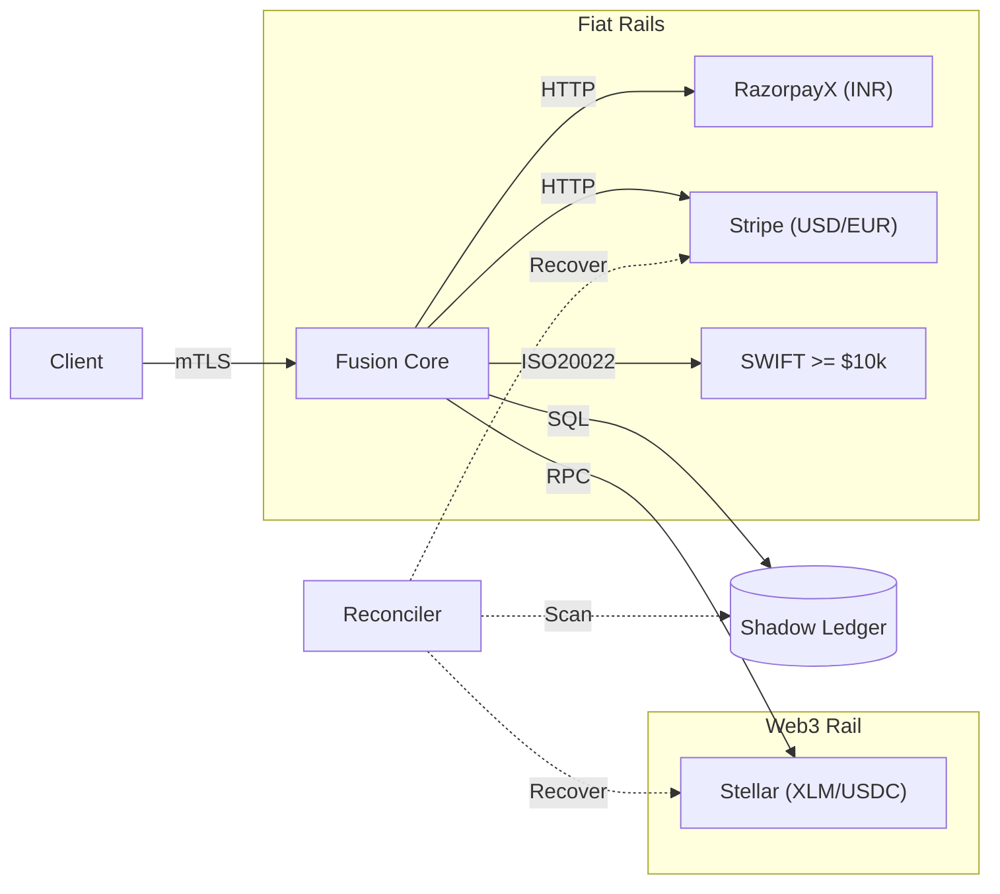

# Project Fusion: Enterprise Payment Orchestration

[](#)
[](#)
[](#)

> **"Financial Correctness at Scale"**
> An institutional-grade Payment Orchestration Platform designed to guarantee atomic settlement across fragmented rails (Banks, Cards, Blockchain).

---

## 🚀 The Core Mission

**Project Fusion** is an institutional-grade **Multi-Asset Orchestration Engine**. It solves the fragmentation problem in modern finance by providing a single, atomic interface across:

1.  **Fiat Domestic**: Real-time Indian payments via RazorpayX (INR).
2.  **Cross-Border Fiat**: Global settlement via Stripe (USD, EUR) and SWIFT/ISO20022 for large transfers.
3.  **Web3 Stablecoins**: Blockchain-native settlement via Stellar (XLM, USDC).

### The Orchestration Problem

Banks and Blockchains speak different languages (ISO20022, RPC, HTTP).
**Fusion acts as the Universal Translator.** It normalizes these fragmented protocols into a standard `Instruction` lifecycle, guaranteeing that every transfer either **succeeds atomically** or **fails safely** — zero "Ghost Money" states.

---

## 🏗️ Enterprise Architecture

The system uses a **Saga-based State Machine** to coordinate these distributed transactions.

### Core Components

1.  **Saga Orchestrator**: Manages long-running transactions across the three rails.
2.  **Shadow Ledger**: Double-entry accounting system that provides an immutable internal source of truth.
3.  **Vault Simulator**: Isolated cryptographic signing module (HSM).
4.  **Reconciler**: Self-healing worker that fixes stuck transactions.



---

## ⚡ Key Capabilities

### 1. Smart Routing Across Three Rails

The **Smart Router** automatically selects the optimal payment path:

- **INR Domestic**: Routed to **RazorpayX Payouts API** for real-time Indian bank transfers.
- **Cross-Border Fiat (< $10k)**: Routed to **Stripe** (USD, EUR, GBP).
- **Cross-Border Fiat (≥ $10k)**: Routed to **ISO20022 / SWIFT** (institutional, avoids card fees).
- **Web3 Stablecoins**: Routed to **Stellar Horizon** (XLM, USDC) — blockchain-agnostic architecture supports Ethereum/Solana.

### 2. Regulatory Observability

Built for compliance from day one.

- **PII Redaction**: Logs are structured (JSON) but strictly sanitized of user data (names, account numbers).
- **Audit Trails**: Every state transition is cryptographically logged.

### 3. Institutional Security & Compliance

- **Mutual TLS (mTLS)**: Zero Trust networking. Both client and server verify identity certificates.
- **Idempotency**: Strict enforcement prevents double-spending on retries.
- **Rate Limiting**: Token bucket algorithm protects upstream liquidity providers.
- **KYC Verification**: Live verification checks (Setu/Signzy architecture) prior to onboarding.
- **Additional Factor of Authentication (AFA)**: OTP verification enforced for all transaction initiations as per RBI/IFSCA guidelines.

---

## 📊 Live System Evidence

The platform provides a **Real-Time Operations Dashboard** for tracking liquidity and settlement states across all connected rails.

### 1. Unified Operations Dashboard

A "Single Pane of Glass" for monitoring global transaction flows.


### 2. Validated Fiat Settlement

Proof of successful end-to-end processing on traditional payment rails.


### 3. Validated Digital Asset Settlement

Proof of successful real-time settlement on blockchain protocols (Stellar Testnet — XLM/USDC).


---

## ⚡ Quick Start (Zero Config)

Run the entire stack (Database, Certs, API, Migrations) with one command:

```bash
# Install dependencies & Auto-Setup
npm install
npm run setup

# Start the Secure Server (mTLS enabled)
npm start
```

_The system will self-heal if the database is missing._

---

## 🧪 Testing Strategy

- **Unit Tests**: Logic verification (`npm run test:unit`)
- **Integration**: Full API flow (`npm run test:integration`)
- **Load Testing**: 660 TPS peak / 50 TPS sustained validated (`npx artillery run tests/load/find_capacity.yml`)
- **End-to-End**: Full Settlement Lifecycle (`npm run test:integration` or `npx jest tests/e2e/settlement.test.js`)

---

## 📜 License

MIT License. Open Source Prototype.
