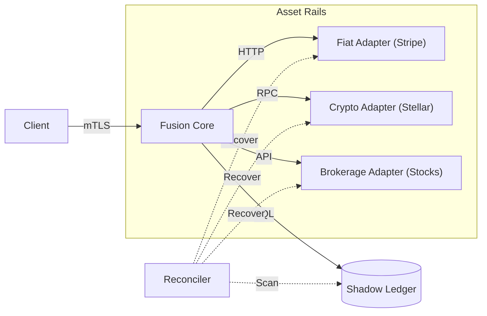
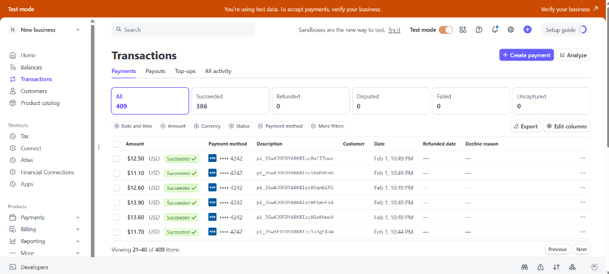
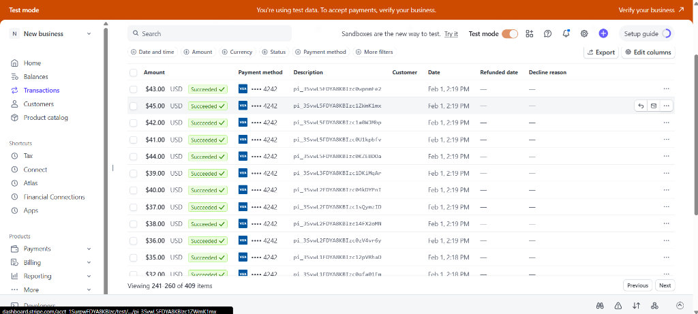
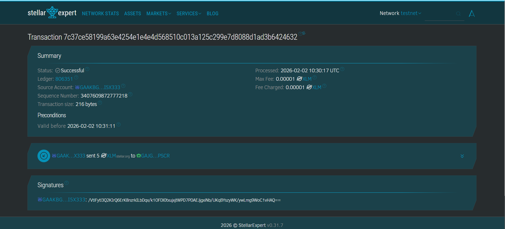
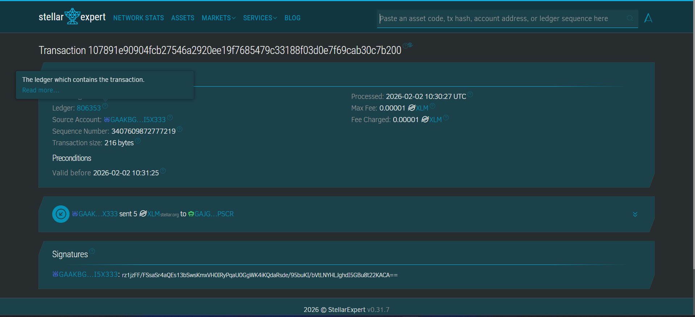

# Project Fusion: Enterprise Payment Orchestration

[](#)
[](#)
[](#)

> **"Financial Correctness at Scale"**
> An institutional-grade Payment Orchestration Platform designed to guarantee atomic settlement across fragmented rails (Banks, Cards, Blockchain).

---

## 🚀 The Core Mission

**Project Fusion** is an institutional-grade **Multi-Asset Orchestration Engine**. It solves the fragmentation problem in modern finance by providing a single, atomic interface to manage three distinct asset classes:

1.  **Fiat Payments**: Real-time settlement (USD, EUR, SGD).
2.  **Digital Assets**: Blockchain-native transfers (XLM, USDC).
3.  **Capital Markets**: Equity and ETF simulations (Brokerage Execution).

### The Orchestration Problem
Banks, Blockchains, and Brokerages speak different languages (ISO20022, RPC, FIX).
**Fusion acts as the Universal Translator.** It normalizes these fragmented protocols into a standard `Instruction` lifecycle, guaranteeing that a complex flow (e.g., "Sell Apple Stock -> Convert USD to USDC -> Send to Wallet") either **succeeds atomically** or **fails safely** without "Ghost Money" states.

---

## 🏗️ Enterprise Architecture

The system uses a **Saga-based State Machine** to coordinate these distributed transactions.

### Core Components

1.  **Saga Orchestrator**: Manages long-running transactions across the three rails.
2.  **Shadow Ledger**: Double-entry accounting system that provides an immutable internal source of truth.
3.  **Vault Simulator**: Isolated cryptographic signing module (HSM).
4.  **Reconciler**: Self-healing worker that fixes stuck transactions.



---

## ⚡ Key Capabilities

### 1. Universal Asset Support
Seamlessly route value between any supported asset class. The "Smart Router" selects the optimal path.

*   **Fiat Implementation**: High-speed processing via **Stripe** (USD, EUR).
    > *Note: Stripe is used as the reference fiat rail for its developer-friendly Testnet. The adapter pattern supports any banking API (SWIFT, ACH, SEPA) or payment processor.*
*   **Crypto Implementation**: Low-latency settlement via **Stellar Horizon** (XLM).
    > *Note: Stellar is currently used as the reference implementation for the crypto rail due to its accessible Testnet. The architecture is blockchain-agnostic and can support any RPC-based protocol (Ethereum, Solana, etc).*
*   **Investment Implementation**: Trade execution interface for **Stocks/ETFs** (Brokerage Simulation).

### 2. Regulatory Observability
Built for compliance from day one.
- **PII Redaction**: Logs are structured (JSON) but strictly sanitized of user data (names, account numbers).
- **Audit Trails**: Every state transition is cryptographically logged.

### 3. Institutional Security
- **Mutual TLS (mTLS)**: Zero Trust networking. Both client and server verify identity certificates.
- **Idempotency**: Strict enforcement prevents double-spending on retries.
- **Rate Limiting**: Token bucket algorithm protects upstream liquidity providers.

---

## 📊 Live System Evidence

The platform provides a **Real-Time Operations Dashboard** for tracking liquidity and settlement states across all connected rails.

### 1. Unified Operations Dashboard

A "Single Pane of Glass" for monitoring global transaction flows.



### 2. Validated Fiat Settlement

Proof of successful end-to-end processing on traditional payment rails.



### 3. Validated Digital Asset Settlement

Proof of successful real-time settlement on blockchain protocols (Testnet).




---

## ⚡ Quick Start (Zero Config)

Run the entire stack (Database, Certs, API, Migrations) with one command:

```bash
# Install dependencies & Auto-Setup
npm install
npm run setup

# Start the Secure Server (mTLS enabled)
npm start
```

_The system will self-heal if the database is missing._

---

## 🧪 Testing Strategy

- **Unit Tests**: Logic verification (`npm run test:unit`)
- **Integration**: Full API flow (`npm run test:integration`)
- **Load Testing**: 660 TPS peak / 50 TPS sustained validated (`npx artillery run tests/load/find_capacity.yml`)
- **End-to-End**: Full Settlement Lifecycle (`npm run test:integration` or `npx jest tests/e2e/settlement.test.js`)

---

## 📜 License

MIT License. Open Source Prototype.
